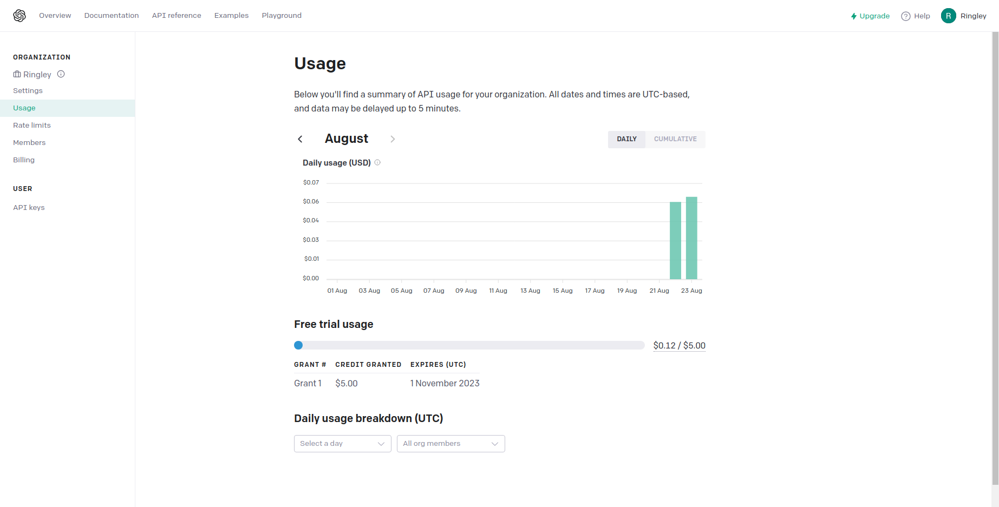

# RingleyChat - AI Based Question-answering Chatbot

- AI Based Question-answering Chatbot](#ringleychat---ai-based-question-answering-chatbot)
  - [0. INTRODUCTION and Updates](#0-introduction-and-updates)
    - [0.1 Pre-trained Emebedding and Language Models](#01-pre-trained-emebedding-and-language-models)
    - [0.2 Updates](#02-updates)
  - [1. INSTALLATION](#1-installation)
    - [1.1 Pre-requisite -\> Make sure you have python environment installed](#11-pre-requisite---make-sure-you-have-python-environment-installed)
    - [1.2 Environment Deploy](#12-environment-deploy)
      - [1.2.1 Annaconda Environment Deploy](#121-annaconda-environment-deploy)
      - [1.2.2 Option 1 - Install the required libraries directly via anaconda](#122-option-1---install-the-required-libraries-directly-via-anaconda)
      - [1.2.3 Option 2 - Deploy the environment via yml file](#123-option-2---deploy-the-environment-via-yml-file)
      - [1.2.4 Set OPENAI\_API\_KEY in your environment](#124-set-openai_api_key-in-your-environment)
      - [1.2.2 Test the environment (Optional)](#122-test-the-environment-optional)
    - [1.3 Run the chatbot demo in CLI (Optional)](#13-run-the-chatbot-demo-in-cli-optional)
  - [2. DEPLOYMENT !\[*IMPORTANT*\]](#2-deployment-important)
    - [2.1 RingleyChat Module \& CLI](#21-ringleychat-module--cli)
      - [2.1.1 Import RingleyChat Module](#211-import-ringleychat-module)
      - [2.1.2 Run the chatbot in CLI](#212-run-the-chatbot-in-cli)
    - [2.2 Account for OpenAI API](#22-account-for-openai-api)
      - [2.2.1 OpenAI API Key !\[*IMPORTANT*\]](#221-openai-api-key-important)
      - [2.2.2 OpenAI API Key Usage](#222-openai-api-key-usage)
  - [3. Local Database](#3-local-database)
    - [3.1 Data Format](#31-data-format)
    - [3.2 Data Structure - Pickle \& FAISS](#32-data-structure---pickle--faiss)
      - [3.2.1 Pickle - For testing purpose (Optional)](#321-pickle---for-testing-purpose-optional)
      - [3.2.2 FAISS Index](#322-faiss-index)
    - [3.3 How to maintain and update the database onto RingleyChat](#33-how-to-maintain-and-update-the-database-onto-ringleychat)
  - [4. Prompt Engineering](#4-prompt-engineering)
    - [4.1 Initialization Prompt for AI](#41-initialization-prompt-for-ai)
  - [5. Further Development](#5-further-development)
    - [5.1 User identification by langchain.agents](#51-user-identification-by-langchainagents)


## 0. INTRODUCTION and Updates

This is an AI-based question answering chatbot system that is capable to present the specific knowledge about the documents you uploaded.

The chatbot relies on the *[ChatGPT-3.5](https://openai.com/chatgpt)* model, as long as the *[langchain](https://github.com/langchain-ai/langchain)* framework to build the whole system. Langchain provides the protocol retriving the local or online database and figure out the most related context information. These information are fed into the Large Language Model (GPT-3.5, Llama, or Vicuna) to generate the response via prompt engineering.

### 0.1 Pre-trained Emebedding and Language Models
This program provides two ways to achieve the ***embedding*** of the context information:
1. **[text-embedding-ada-002](https://platform.openai.com/docs/guides/embeddings/what-are-embeddings)** - The context information is embedded by the OpenAIEmbeddings model, which requires OpenAI's API to generate the embeddings. The API key is required to run the program and it charges the cost of the API usage in terms of tokens (1000 tokens approximately equal to 700 words of embedding usage and chatbot inference).
2. **[InstructEmbeddings](https://instructor-embedding.github.io/)** - The open source pre-trained embedding model published by the paper: [One Embedder, Any Task: Instruction-Finetuned Text Embeddings (ACL2023)](https://arxiv.org/abs/2212.09741), which can be used freely through Huggingface API. The performance is slightly worse than the OpenAIEmbeddings, but it is free to use. This can be used in any test environment without the OpenAI API key for embedding. 

Except for the embedding, the chatbot also provides two ways to achieve the ***inference*** of the chatbot:
1. **[gpt-3.5-turbo](https://platform.openai.com/docs/models/gpt-3-5)** - The GPT-3.5 model is the combination of GPT-3 and GPT-2. It is a powerful model that can generate the response with the context information. However, it requires the OpenAI API key to run the program and it charges the cost of the API usage in terms of tokens (1000 tokens approximately equal to 700 words for chatbot inference).
2. **[vicuna-13b-delta-v0](https://huggingface.co/lmsys/vicuna-13b-delta-v0)** - The [Vicuna](https://lmsys.org/blog/2023-03-30-vicuna/) model is an open-source chatbot trained by fine-tuning LLaMA on user-shared conversations collected from ShareGPT. It is a powerful model that can generate the response with the context information. It is free to use and can be used in any test environment without the OpenAI API key for inference.

By default, we use the **text-embedding-ada-002** and **pt-3.5-turbo** to build the chatbot system, which costs the OpenAI API tokens but provides the best performance. If you want to use the free version, you can change the embedding and inference model to **InstructEmbeddings** and **vicuna-13b-delta-v0** in the `config.json` file.

To know more about the key concepts of the chatbot system, please check the following link: [OpenAI Documentation - key concepts](https://platform.openai.com/docs/introduction/key-concepts).

---

### 0.2 Updates

> Update on 2023-08-17 by CHEN Rubing (Anya)

The performance of model and langchain can be improved in the future, thus the chatbot system can be improved as well. Please check the following list for the updates and further development:
- [Huggingface transformers](https://huggingface.co/docs/transformers/index) library: to check if there is any new state-of-art model that can be used for the chatbot system, with cheaper cost and faster inference.
- [ChatGPT-4](https://platform.openai.com/docs/models/gpt-4): best performance and comprehensive language understanding so far (Aug 2023), but it is only available with OpenAI API and the cost is more expensive. We can try to apply for the beta version and test the performance.


<br>

## 1. INSTALLATION

### 1.1 Pre-requisite -> Make sure you have python environment installed

Check if you have pip installed in your system
```bash
pip --version
python3 --version
```
If not, try: 
```bash 
sudo apt install python3-pip
```
---


### 1.2 Environment Deploy

The whole project is built by python3 langauge, and the requirement libraries are listed in the requirements.txt file. Conda environment is recommended to deploy the project.

#### 1.2.1 Annaconda Environment Deploy

Step 1 - Download the conda installer for linux -> https://docs.anaconda.com/free/anaconda/install/linux/
```bash
bash Anaconda3-2023.07-2-Linux-x86_64.sh # install the conda
# Add the conda to your PATH
export PATH="/home/$your_username/anaconda3/bin:$PATH"
# Add the conda init to your shell
eval "$(/home/developer/anaconda3/bin/conda shell.bash hook)"
# Check if the conda is installed
conda --version
```

---


#### 1.2.2 Option 1 - Install the required libraries directly via anaconda

Step 1 - Create the conda environment
```bash
conda create -n env_name python=3.8 # create the conda environment
conda activate enb_name # activate the environment
```
Step 2 - Install the required libraries

There are several large librairs, occupying several GiBs in your disk, which is time consuming to install them all. If you don't want to install them, you can comment them in the requirements.txt file.

The whole process of installing the required libraries might take hours depending on the quality of your internet connection. Don't worry about it, just wait patiently.

```bash
pip install -r requirements.txt
```

#### 1.2.3 Option 2 - Deploy the environment via yml file

Note: If you have already installed `ringley` as your conda env's name, please change the name of the environment for deploying the yml file. Otherwise you may trigger the `CondaValueError`.

```bash
conda env create --name ringley --file=ringley.yml
conda activate ringley
```
---


#### 1.2.4 Set OPENAI_API_KEY in your environment

```bash
# Set the OPENAI_API_KEY in your environment
echo "export OPENAI_API_KEY='yourkey'" >> ~/.zshrc  # add the OPENAI_API_KEY to your environment
source ~/.zshrc
echo $OPENAI_API_KEY    # check if the OPENAI_API_KEY is set
```
```python
# To call the OPENAI_API_KEY in your python code
import os
import openai
openai.api_key = os.environ["OPENAI_API_KEY"]
```
```bash
# To test the OPENAI_API_KEY connection in your terminal
curl https://api.openai.com/v1/chat/completions \
  -H "Content-Type: application/json" \
  -H "Authorization: Bearer $OPENAI_API_KEY" \
  -d '{
     "model": "gpt-3.5-turbo",
     "messages": [{"role": "user", "content": "Say this is a test!"}],
     "temperature": 0.7
   }'

# Example of a successful connection
# {
#   "id": "chatcmpl-7oXVeZTATRX16bgMt6sbfSfVvqlb5",
#   "object": "chat.completion",
#   "created": 1692279566,
#   "model": "gpt-3.5-turbo-0613",
#   "choices": [
#     {
#       "index": 0,
#       "message": {
#         "role": "assistant",
#         "content": "This is a test!"
#       },
#       "finish_reason": "stop"
#     }
#   ],
#   "usage": {
#     "prompt_tokens": 13,
#     "completion_tokens": 5,
#     "total_tokens": 18
#   }
# }
```

---

#### 1.2.2 Test the environment (Optional)

```bash
python3 test_env.py --api --test
```

If you see the following output, then the environment is successfully deployed. Otherwise, please check the error message and try to fix it, or directly use `pip install $package_name` to install the missing package in your conda environment.

```bash
[INFO] Congratulations :) The environment is successfully deployed!
```
---


### 1.3 Run the chatbot demo in CLI (Optional)

The chatbot demo contains a test dataset, including the csv file of FAQ data provided by Ringley. It is a command line interface (CLI) that can be run by the following command:

```bash
python3 cli.py
# To exit the chatbot, type `!!exit` in the command line.
# To clear the chat history, type `!!reset` in the command line.
```
Here is an example of the conversation with the chatbot:
```txt
Chat with your docs!
---------------
Your Question: : hello
Answer: Hello! How can I assist you today?
---------------
Your Question: : who are you
Answer: I am RingleyChat, an AI-based virtual assistant. How can I assist you today?
---------------
Your Question: : How does Ringley manage user's bank account?
Answer: RingleyChat manages user's bank accounts by following the RICS Rules and Regulations. All bank accounts are administered according to these rules, and bank reconciliations are performed by the end of the full week period following. If your Service Charge Accounts are in credit, you will receive interest. If you have any specific questions or concerns about your bank account, please provide the details of your property, the property owner's name, and your email address so that we can assist you further.
---------------
Your Question: : great, tell me more about how can I pay for Ringley's service?
Answer: To pay for Ringley's services, you have the option to make monthly payments by standing order. This allows for convenient and regular payments towards your service charge. However, if you are unable to afford the service charge, it is important to note that not paying may result in a breach of the terms of your lease. Regarding refunds, if you find yourself in credit, you can request a refund. Ringley follows the RICS Rules and Regulations and has standard processes in place to administer bank accounts and perform bank reconciliations. If you have any specific questions or concerns about your payment or refund, please provide the details of your property, the property owner's name, and your email address as recorded by Ringley.
---------------
Your Question: : what can I do if my bank account is frozen?                  
Answer: If your bank account is frozen, it is important to contact your bank immediately to understand the reason behind the freeze and to discuss potential solutions. Ringley does not have the authority to manage or provide advice on individual bank accounts. However, if you have any concerns or questions regarding your property or services provided by Ringley, please provide the details of the property, the property owner's name, and your email address so that we can assist you further.
---------------
```
<br>

## 2. DEPLOYMENT ![*IMPORTANT*] 

### 2.1 RingleyChat Module & CLI
The project provides two ways to deploy the chatbot system: you can import ***class*** `RingleyChat` from `RingleyChat.py` to build the chatbot system with a data stream containing input from users and output from the model; or you can run the `RingleyChat.py` directly to run the chatbot in the command line interface (CLI). 
#### 2.1.1 Import RingleyChat Module
The way to call RingleyChat module is shown in `test_call.py`, or you can check the following code:
```python
from RingleyChat import RingleyChat

ringley_chat = RingleyChat(update_data=False)
while True:
    question = input("Your Question: ")
    # To exit the chatbot, type `!!exit`
    if question == "!!exit":
        break
    result = ringley_chat.chat(question)
    # To access the answer, use `result['answer']`
    print("Answer: " + result['answer'])
```
The `update_data` is a boolean variable that determines if the program will update the local database (Note that each time of updating will **cost** tokens from OpenAI API). If it is set to `True`, then the program will update the local database with the online database. If it is set to `False`, then the program will only use the local database. The default value is `False`.

To call RingelyChat module, you need to provide the OpenAI API key in the `config.json` file. If you want to call it in other programming languages, you can check the following reference for further develpopment:
> There are a few ways to call Python code from within the Ruby language. 
> 
> One way is to use the `RubyPython` library, which allows you to start a Python interpreter within Ruby and import Python modules. Another way is to use the `PyCall` library, which provides features to directly call and partially interoperate with Python from the Ruby language. (reference from newbing)
>
> - [PyCall: Calling Python functions from the Ruby language](https://github.com/mrkn/pycall.rb)
> - [Module: RubyPython](https://www.rubydoc.info/gems/rubypython/0.6.3/RubyPython)


#### 2.1.2 Run the chatbot in CLI
To run the chatbot locally in the terminal for testing purpose, you can run the following command:
```bash
python3 RingleyChat.py
```
If you want to enlarge the dataset and *update* the local embeddings for query, you can run the following command (rememver to put the new data in the `data/update` folder):
```bash
python3 RingleyChat.py --update_data
```

Here is what you will see in the terminal if the data has been updated successfully:
```bash
[INFO] Start updating data...
[ATTENTION] Please make sure you have the latest data in the data/update folder.
[ATTENTION] Do not modify the data in the data/update folder until the embedding is finished.
Successfully load the data test.html into vectorstore.
Cut the data test.html from the update data directory into data...
Successfully cut the data test.html from the update data directory into data.
=====================================
Successfully saved the vector store into faiss.
=====================================
```

The interface is similar to the CLI demo, and you can check the inference example [here](#13-run-the-chatbot-demo-in-cli-optional).

---

<br>

### 2.2 Account for OpenAI API
There is an acount for accessing the OpenAI API, which is used for the chatbot inference and embedding. The account information is listed below (remember to log in via *Google Account* when accessing the dashboard):
```txt
username: Ringley-Anya
email: ringleyanya@gmail.com
passwd: RingleyLondon.1
```
If the account is expired or the API Key run out of all the data limit, please contact the administrator to renew the account or top up the API usage.

Sometimes the access rate is limited due to the high usage of the API. Also, the server of OpenAI can sometimes crash if there are too many requests, so please be patient and wait for a while if you found `RateLimitError` from OpenAI API.

#### 2.2.1 OpenAI API Key ![*IMPORTANT*]

To require or update the OpenAI API key, please check the following link and login the OpenAI account using the above account information:
[Open AI API Overview](https://platform.openai.com/overview).

Here is a screenshot of the OpenAI API key usage in the dashboard:


There are **$5.0** worth of tokens left in the account, which is the free access given by OpenAI since this account has been created, for embedding usage and chatbot inference. The free access is limited and will expire in Nov-01 2023, so please use it wisely.

> *Do not forget to **top up** the API usage if the tokens run out. Otherwise, the chatbot will not work properly.*


<br>

#### 2.2.2 OpenAI API Key Usage

You can check the usage of the OpenAI API key by using the data in API request. Check OpenAI's [documentaion on checking token usage](https://help.openai.com/en/articles/6614209-how-do-i-check-my-token-usage) for more information.


<br>

## 3. Local Database

The local database is used to store the context information, which is used to generate the response. The database is stored in the `data` folder, and the data can be stored in the various formats. 

The database is built by the [langchain document loader](https://python.langchain.com/docs/modules/data_connection/document_loaders). The document loader is a protocol that can be used to retrive the context information from the local or online database. To save the token usage in the process of embedding, the program stores the embedded vectorspace locally once the document loader is called. The embedded vectorspace is stored in the `embeddings` and `faiss` folder according to the different way of storing.

### 3.1 Data Format
The program supports the following data formats:
```python
self.switcher = {
            "txt": UnstructuredFileLoader,
            "csv": CSVLoader,
            "json": JSONLoader,
            "html": BSHTMLLoader,
            "md": UnstructuredMarkdownLoader,
            "pdf": UnstructuredPDFLoader
        }
```
Different data format will call the relavent document loader to load the data. The data format is determined by the file extension. For example, if the file extension is `.txt`, then the program will call the `UnstructuredFileLoader` to load the data. If the file extension is `.csv`, then the program will call the `CSVLoader` to load the data.

### 3.2 Data Structure - Pickle & FAISS

We provide two approaches to store the embedded vectorspace locally: pickle and FAISS index. The pickle file is used for testing purpose, and the FAISS index is used for the production environment.

| Data Structure | Pros | Cons |
| :---: | :---: | :---: |
| Pickle | Easy to use; Cheap | Inconvinient to update; Unstable; Inflexible in terms of development |
| FAISS Index | Fast; Stable; Easy to update | Expensive; Repetitive update happens, but does not affect the products |


#### 3.2.1 Pickle - For testing purpose (Optional)
After chunking and embedding the human-readable raw data, the program in `database.py` will store the embeddings into the `embeddings` folder using pickle library, which is a tool used to record the vector embeddings locally. 
However, pickle file is not a good choice for storing the embeddings of a large dataset, because it is inconvinient to update and renew. Thus, we use pickle only for the testing purpose in `cli.py`.

#### 3.2.2 FAISS Index
[FAISS Index](https://api.python.langchain.com/en/latest/vectorstores/langchain.vectorstores.faiss.FAISS.html#langchain.vectorstores.faiss.FAISS.save_local) is a file format that stores dense vectors for efficient similarity search and clustering. It is supported by Langchain, a library for natural language processing and generation.

The embedded data is stored in `faiss` containing a vector space and an index file for query. The updates and sync of the dataset is being handled in the `database.py` file. The program will update the local database from `data/update` into `data` once the `update_data` is set to `True` when calling the RingleyChat.

Once the dataset is being updated, the files insdie `data/update` will be remove to `data` and the folder will be empty.

---


### 3.3 How to maintain and update the database onto RingleyChat

- Step 1: Put the new data into `data/update` folder. Note that the data should be in the format of `.txt`, `.csv`, `.json`, `.html`, `.md`, or `.pdf`. Also, sometimes the amount of characters in one data file is too large to embed by OpenAI API, so please split the data into several files if necessary. Pure text document is recommended.
- Step 2: Run the RingleyChat with `update_data` set to `True` to update the local database. The program will automatically update the local database from `data/update` into `data` once the `update_data` is set to `True` when calling the RingleyChat.

```bash
python3 RingleyChat.py --update_data
```
> **[ATTENTION] Once the data is being updated, the embedded vectorspace will be updated and merged to the previous one. Thus, the updates cannot be reversed. Please make sure the data is correct before updating the database.**
> 
> Otherwise you need to embed all existing dataset again, which will cost lots of token usage.


<br>

## 4. Prompt Engineering

The *prompt engineering* is the key to generate the response from the context information. The performance of AI chatbot is highly related to the quality of the prompt. Thus, the prompt engineering is the most important part of the project. We need to lead the AI by prompting, and few-shot leanrning to achieve the best performance. I will introduce how to design the prompt in the following section.

In this project, we separate the usage of the prompt into several instuctors, to make the AI chatbot capable to achieve different tasks. The current prompt templates storing in `util.templates.py` is being well tested with relatively satisfying performance. However, it can be improved in the future, in case if there is any new demands that needs to be updated.


---


### 4.1 Initialization Prompt for AI
There are several key points that need to be considered when designing the prompt:
1. **The prompt should be short and concise.** The AI model is not capable to understand the long sentence, and it is not necessary to provide the long prompt. Long prompt will increase the cost of the API usage, and it will also increase the inference time and somehow decrease the memory ability of the model. Imagine that a person cannot perceive such a long text at once, so avoid to do it to AI as well.
2. **Instruct AI about its role and responsiblity.** The AI model is not capable to understand the context information, so we need to instruct the AI about its role and responsiblity of being RingleyChat's virtual assistant. For example, we need to tell the AI what knowledge it has and what kind of task it is capable to response.

To update the prompt templates, you can directly modify the `util.templates.py` file. The prompt templates are called in `util.query.py` for your information.

```python
QA_PROMPT_FAISS = """You are RingleyChat. You are an AI-based question answering virtual assistant. You act as a polite and considerate consultant. You are talking to a user who interests in you and Ringley's services. You are capable to present the professional knowledge about Ringley (London)'s articles, blogs, and the customer services.
You are given the following extracted parts of a long document and a question. Provide a conversational answer.
If the user is greeting you, you can answer it freely and energetically.
If the question is not about the services in Ringley, just chat with user casually.
If the user would like to authenticate his existing service in Ringley, politely ask the user to provide the details of the property, the property owner's name, and the user's email which can be found in Ringley's record.
If the question is about the user services in Ringley, but you don't know the answer, just say "Sorry, I'm not sure about it. You will need to email your query to solutions@ringley.co.uk or phone 0207 267 2900" Don't try to make up an answer.
Question: {question}
=========
{context}
=========
Answer in Markdown:"""
```
```python
# The prompt template is called in `util.query.py` as follows:
CONDENSE_QUESTION_PROMPT = PromptTemplate.from_template(templates.CONDENSE_QUESTION_PROMPT)
QA_PROMPT = PromptTemplate(template=templates.QA_PROMPT_FAISS, input_variables=["question", "context"])
```

<br>
<br>


## 5. Further Development
If you have any further development or improvement, please feel free to contact me (ru-bing.chen@connect.polyu.hk) or directly make a pull request to the repository.

### 5.1 User identification by langchain.agents
ChatGPT-3.5 is good at generating answers for natural language questions, but it's weak in terms of quantitive tasks, such as calculating the user's service charge, authenticating any information containing numbers (e.g. mobile phone, email, or even the property lables). Thus, we need to identify the type of the question, to determine if the question is about the user's personal service or the general service in Ringley, and target the task specifically.

By doing so, langchain's `agent` framework can be used to improve its performance on doing specific work and call other functions to generate particular prompts for that.

For example, if the question is about the user's personal service, then the chatbot can ask the user to provide the details of the property, the property owner's name, and the user's email which can be found in Ringley's record. Then the chatbot can call the `langchain.agents` to authenticate the user's information and generate the response.

This can be done by the following steps:
1. Identify the type of the question (e.g. personal service or general service)
2. Call the `langchain.agents` to authenticate the user's information
3. Generate the response by the chatbot
4. Send the response to the user
5. If the user is not satisfied with the response, then repeat the process from step 1 to step 4.
6. If the user is satisfied with the response, then end the conversation.

If you have any further development or inquery, please feel free to contact me:
> **CHEN Rubing (Anya)**
> > Email: ru-bing.chen@connect.polyu.hk
> >
> > Whatsapp: +852 9144 7198